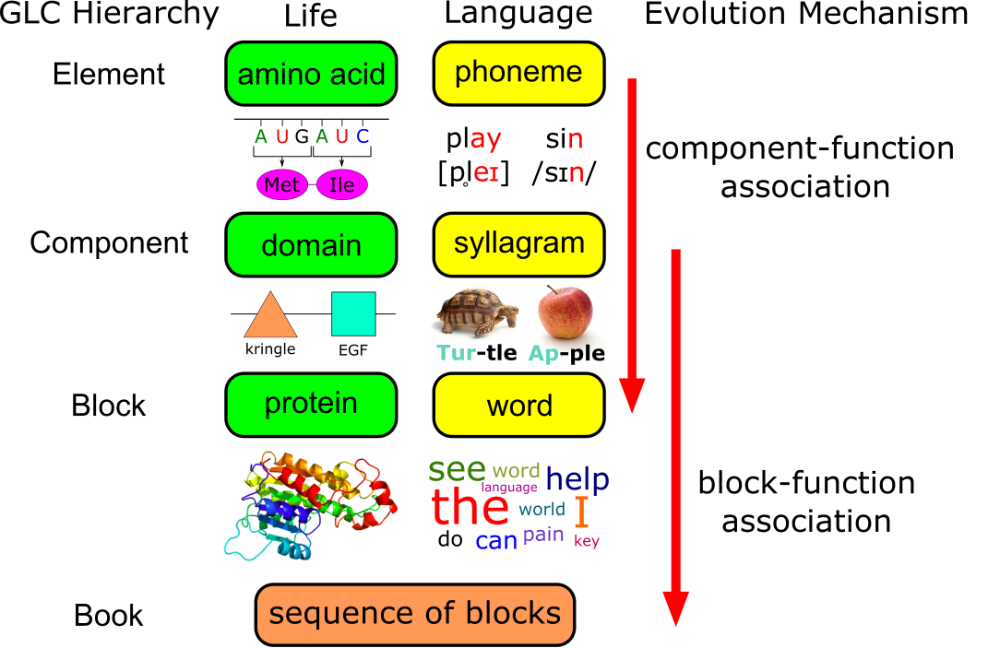
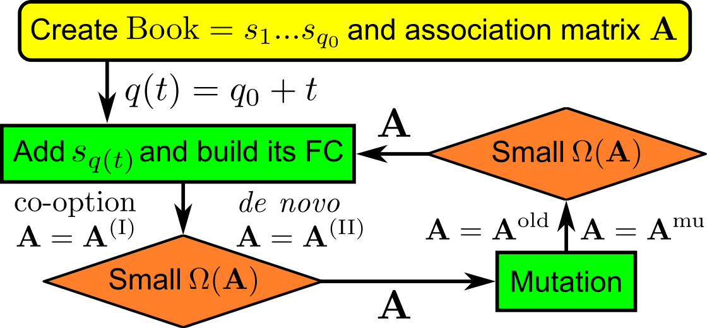

# GLC (Genetics-Linguistics Correspondence)
>This research utilizes fundamental physical principles to construct a framework for predicting the evolution of sequences, including protein sequences and human language. The framework also generates new sequences and analyzes the statistical characteristics that are indicative of life and language, such as Zipf's law and power-law degree distribution.

## Table of Contents
* [General Info](#general-information)
* [Features](#features)
* [Setup](#setup)
* [Usage](#usage)
* [Project Status](#project-status)
* [Room for Improvement](#room-for-improvement)
* [Acknowledgements](#acknowledgements)
* [Contact](#contact)

## General Information
- Main spirt - Life and language share many common characteristics, making it possible to analyze them using a generalized framework.
- Main Problem - The quantitative measurement of natural selection for sequences is an unresolved issue. Furthermore, existing algorithms for generating and forecasting sequences often lack transparency and $\text{\textcolor{red}{interpretability}}$. 
- This project provides 

(1) An evolutionary algorithm designed to generate text or protein sequences through simulating the process of natural selection.

(2) Several fake generators capable of producing artificial text.

(3) Tools for analyzing human text or protein sequences..

- Technical details can be found in `SI.pdf`.

## Features
List the ready features here:
- Only requires $\text{\textcolor{red}{4 parameters}}$ to generate sequences that conform to the statistical properties of human text and protein sequences.
- Capable of simulating mutation and forecasting evolutionary changes.
- Evolution and variation are based on fundamental principles that can be explained, not a $\text{\textcolor{red}{black-box}}$ mechanism.
- Rank-rank analysis allows for the uncovering of previously hidden information about life and language.

## Setup
1. Install Anaconda with Python 3
2. Environment: ipynb files can be excuted on Jupyter notebook. 

### For algorithm of evolution and generating sequence
You can use the demo on google colab [_here_](https://colab.research.google.com/drive/1h8tNyqPPnqfmG9g7BiD-w4jzSz-npnJa#scrollTo=lwZnojnDFM5Y)
or access `evolution_mechanism.ipynb` and run it on your local computer using appropriate software such as $\text{\textcolor{red}{Jupyter notebook}}$.

### For generating artificial text
Refer to the information at page 4 of `SI.pdf`, or the readme in the folder `./fake generator`.

### For analysis of protein sequence, language, and general sequence
1. Select the appropriate discipline:  
  - For analyzing protein sequences, navigate to the `genetics` folder.
  - For analyzing language, navigate to the `linguistics` folder.
  - For analyzing general sequences, navigate to the `general` folder.
2. Break down the sequence into its constituent blocks and components using a segmentation algorithm. For further instructions, refer to the corresponding folder.
  - If you do not have a segmentation algorithm, refer to the recommended software in the corresponding folder.

## Usage
### The algorithm of evolution

1. Configure the parameters: `L`, `N_max`, `P_N`, `lam`, `z`, `P_mu`, and `T`. The crucial parameters are (`lam`, `z`, `P_mu`, `T`).
2. Run the program, it will output a txt file.
3. Move the txt file to the `general` folder and execute the `Run_case_by_case.ipynb` file, it will provide the analysis results.

### The analysis tool
Use either `Run_case_by_case.ipynb` or `Run_All.ipynb` to analyze your segmented sequence:
- If you wish to analyze a single text, utilize `Run_case_by_case.ipynb` and place the text in the same directory as the `Run_case_by_case.ipynb`.
- If you aim to analyze multiple texts, use `Run_All.ipynb` and place the texts in the `./data/Text` directory.

## Project Status
Project is: _complete_ 

## Possible future updates
### For evolution algorithm
- Allow for user-defined function connection network (current version: random FC)
### For analysis tool
- Develop segmentation algorithms for unknown languages or non-coding DNA
- Implement the ability to automatically determine the corresponding parameters for the evolution algorithm when analyzing real-world data.

## Acknowledgements
- This project was based on [arxiv](https://arxiv.org/abs/2012.14309).

## Contact
Created by [@FireIceMan](https://github.com/FireIceMan) - feel free to contact me!
